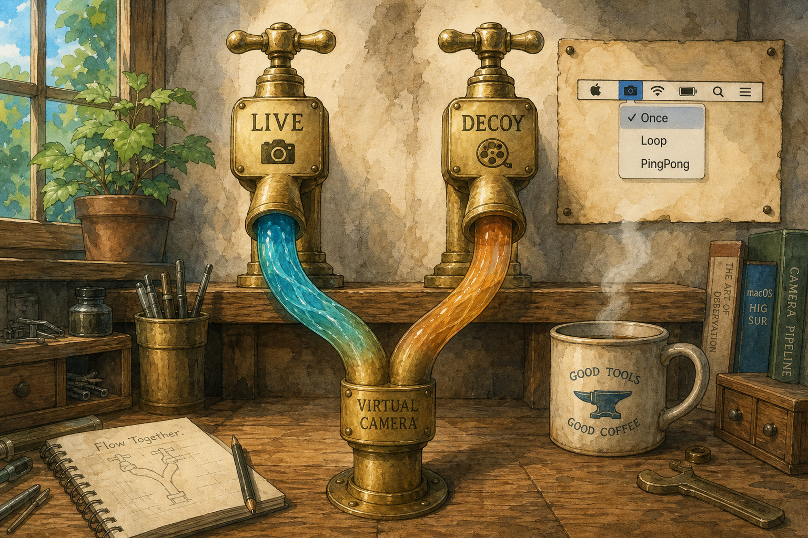
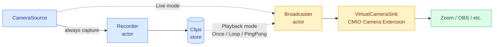

<p align="center">
  
</p>

# Decoy

     [](https://codecov.io/gh/jozobeer/decoy)

> 撮ることと、 ことを、別の  にする

Record a short clip and swap your virtual camera between live and decoy — a macOS menu bar app.

---

## Dream

Web 会議や配信中、ほんの少し  を立ちたい瞬間がある。でも「 します」と宣言するほどでも、カメラを切るほどでもない。その間だけ、事前に  っておいた自分の映像をループさせて「」ことにする。

鍵は **撮ることと  ことの **。録画経路は常にカメラそのものを録り、放送中のデコイは録らない。だから「デコイを流したまま、次のデコイを録る」「ライブを流しながら、念のため録っておく」が自然にできる。録ったクリップはいつでも放送にすり替えられる。

再生は **Once / Loop / PingPong** の 3 モード。Once は再生完了で自動的に Live に戻る「投げっぱなし」モード、Loop / PingPong は止めるまで回り続ける（PingPong は往復でシームを目立たせない）。

操作はメニューバーとショートカットキーだけ。動画編集ツールでも複数クリップ管理ツールでもなく、**「今だけ、 ことにしておく」を  操作で叶える道具**。

詳細・選定の経緯は [`.claude/CLAUDE.md`](./.claude/CLAUDE.md) の ADR セクション参照。

---

## アーキテクチャ

カメラの  は `Recorder` と `Broadcaster` の 2 つの独立 actor に  されている。`Recorder` は常に `CameraSource` から  り、`Broadcaster` は live モードで `CameraSource` を、playback モードで `Clips` を 。両者の出力は `VirtualCameraSink`（CMIO Camera Extension）経由で Zoom / OBS / etc. に届く。



実線（`-->`）は常時通る経路、点線（`-.->`）は `OutputMode`（`Live` / `Playback`）でどちらか片方だけ通る経路。`Recorder` は出力経路の状態によらず常に `CameraSource` を見ている、という Dream の不変条件がそのまま図に出る。

- お手本骨格：[GeneralD/lyra](https://github.com/GeneralD/lyra)
- 詳細は [`.claude/CLAUDE.md`](./.claude/CLAUDE.md)

---

## 開発

TDD で進める。詳細は [`.claude/CLAUDE.md`](./.claude/CLAUDE.md)。

### SPM (lib targets / tests)

```sh
swift build
swift test
```

### Xcode (Decoy.app / SystemExtension bundle)

`Decoy.xcodeproj` は [xcodegen](https://github.com/yonaskolb/XcodeGen) で `project.yml` から生成する。`.xcodeproj` 自体は gitignore されていて、source of truth は `project.yml`。

```sh
brew install xcodegen   # 初回のみ
xcodegen generate       # project.yml → Decoy.xcodeproj
xed .
```

CI でも同じ手順で再生 → `xcodebuild build`。署名は release tag workflow で別途。

---

## License

MIT（[LICENSE](./LICENSE)）
